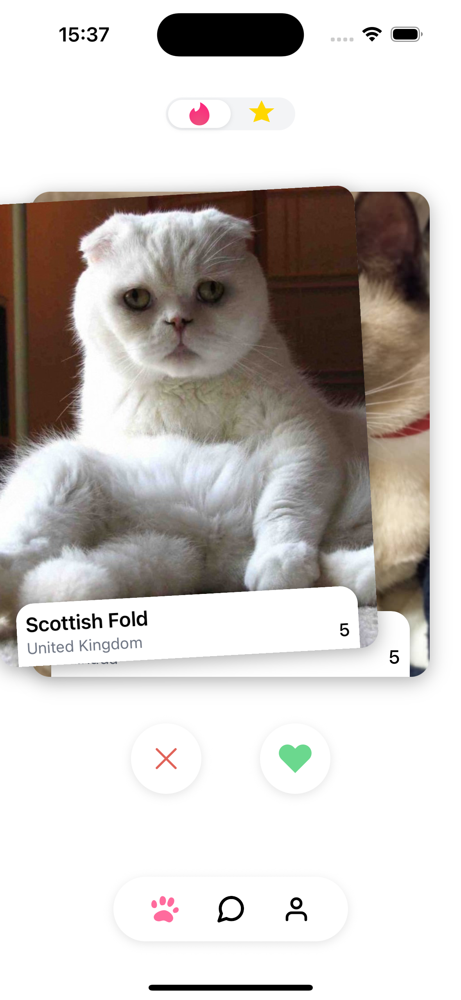

# Cat Tinder App

A Tinder-like mobile app for cats, made with React Native and The Cat API. It lets users swipe on cat cards, like/dislike, and view matches. This doc try to explains how things are put together and how to run it locally.

## Features

- Swipe interface with smooth animations (left = dislike, right = like)
- Cat profiles powered by The Cat API (images + basic info)
- Bottom tab navigation: Swipe, Matches, Profile
- API integration with basic voting flows
- Single-card stack with tilt and swipe
- Action buttons for like and dislike
- Works on iOS and Android, with platform-specific polish

## Screenshots

### Splash Screen


*The splash screen with lottie animation that shows when app starts. It matches the vibe of the project and gives nice entry feel.*

### Main Swipe Interface


*This is how the main swipe screen looks normally. You can see the cat card with info overlay and the like/dislike buttons at bottom.*

### Swipe Animations


*When you swipe left to dislike, the card tilts and shows the red cross overlay with smooth animation.*


*When you swipe right to like, the card tilts and shows the green heart overlay. The animation feels natural and responsive.*

### Liked Cats View


*In the Star tab you can see all the cats you liked. The grid shows them nicely and you can scroll through your favorites.*

## Tech Stack

- React Native (0.81)
- TypeScript
- React Navigation (tabs + native stack)
- Reanimated, Gesture Handler, and basic Animated APIs
- Axios for network calls
- Styled Components for styling
- Jest + React Testing Library for tests

## Project Structure

```
src/
├── components/
│   ├── actions/                    # Like/Dislike buttons
│   ├── cat/
│   │   └── SwipeableCatCard/       # Main swipeable card
│   ├── navigation/
│   │   └── BottomNavigation/       # Custom bottom tab bar
│   └── ui/                         # Generic UI (e.g., SplashScreen)
├── hooks/                          # Custom hooks (data, gestures, etc.)
├── screens/
│   ├── SwipeScreen/                # Swipe flow (stack + screen)
│   ├── MatchesScreen/              # Matches list (placeholder now)
│   └── ProfileScreen/              # User profile (placeholder now)
├── services/
│   └── api/
│       └── CatAPI.ts               # The Cat API integration
├── utils/
│   └── constants/                  # colors, spacing, typography
└── types/                          # TypeScript types
```

Note: There is also `context/` prepared if we need shared state later, it is light right now.

## Getting Started

### Prerequisites

- Node.js 18+
- React Native CLI environment setup (Android Studio / Xcode)
- iOS Simulator or Android Emulator (or device)

### Install

```sh
npm install
```

#### iOS

```sh
cd ios && pod install && cd ..
npx react-native run-ios
```

#### Android

```sh
npx react-native run-android
```

## Configuration (API)

We use The Cat API. By default the service reads an API key from code. For proper setup you should use env (and avoid committing sensitive keys). For now, the key can be changed in:

- `src/services/api/CatAPI.ts`

Later we can move to `.env` with a small wrapper if needed.

## Development Notes

### Components

Typical structure (not every component has all of these files yet):

- `ComponentName.tsx` – main component
- `ComponentName.types.ts` – TS types and props
- `index.ts` – exports

### Design System

- Colors: `src/utils/constants/colors.ts`
- Spacing: `src/utils/constants/spacing.ts`
- Typography: `src/utils/constants/typography.ts`

## Testing

We have unit and component tests for core areas (hooks, API, and some UI). To run tests:

```sh
npm test -- --watchAll=false
```

Some tests mock native modules and API. There might be minor "act(...)" warnings during async updates; those are planned to be polished.

## Current Status

- Swipe flow works end-to-end with animations
- Real cat images via The Cat API
- Basic error and loading states present
- Custom bottom tab with consistent shadow on Android and iOS
- Portrait orientation locked on both platforms

## Extra Work

- Added a splash screen that matches the vibe and style of the project. It uses a small lottie animation and shows before the main app comes in, so the entry feels smoother.
- The top toggle lets you switch between swipe view and seeing liked cats. You can view liked cats in the Star tab right on top and it refresh works fine.
- Wrote tests (both unit and mock tests) that cover most of the critical parts: the Cat API service, the main swipe flow, liked-cats grid and important UI interactions. Some mocks are used to isolate native pieces and network.
- SVG icons are used across the UI to keep transitions and visuals consistent on both platforms, which make the UI feel more clean when moving between screens.

## Notes

- The app is currently locked to portrait mode. I didn’t had time to build responsive layouts for both landscape and portrait. It’s quite easy to add later (mostly style updates and a couple layout tweaks), just didn’t get enough time this round.
- All designs are followed according to the Figma as close as possible given the time.
- On the cat card the design showed a number “4”. I wasn’t sure what it represented, so I mapped it to the "adaptability" field coming from the API, which seemed reasonable here.

## Roadmap

- Matches screen data and interactions
- Better caching and offline handling
- Move API key to env and add interceptor layer
- More tests around edge cases and gestures

## Troubleshooting

- If Metro acts weird, try:
  - `npx react-native start --reset-cache`
  - kill old Metro: `pkill -f "react-native start"`
- Ensure pods are installed after native deps change: `cd ios && pod install`


